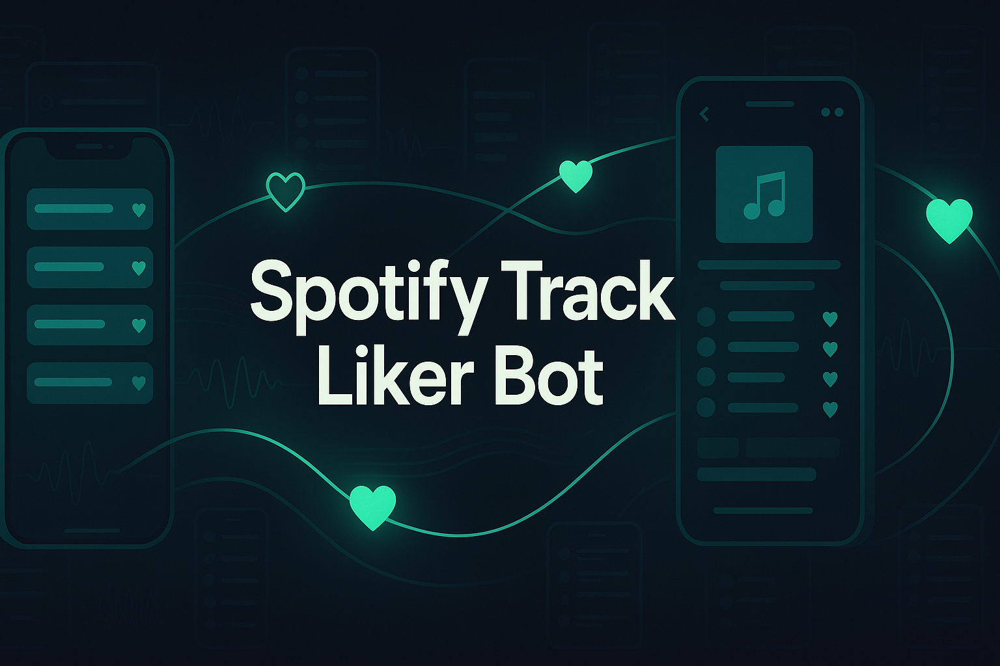

# Spotify Track Liker Bot

Automate “liking” tracks on Spotify from playlists, artists, or mood-based rules — at scale, across real Android devices and emulators. This system reduces repetitive tapping, applies human-like behavior, and enforces safe pacing so your library grows steadily while keeping accounts healthy. Built for agencies and power users who want reliable, configurable engagement automation.

<p align="center">
  <a href="https://Appilot.app" target="_blank">
    
  </a>
</p>
<p align="center">
  <a href="https://t.me/devpilot1" target="_blank">
    
  </a>&nbsp;
  <a href="https://wa.me/923249868488?text=Hi%20Appilot%2C%20I'm%20interested%20in%20automation." target="_blank">
    
  </a>&nbsp;
  <a href="mailto:support@appilot.app" target="_blank">
    
  </a>&nbsp;
  <a href="https://appilot.app" target="_blank">
    
  </a>
</p>

<p align="center"> 
   Created by Appilot, built to showcase our approach to Automation!<br>
   <strong>If you are looking for custom Spotify Track Liker Bot, you've just found your team — Let’s Chat.👆👆</strong>
</p>

## Introduction
This automation signs in to Spotify on Android (real devices or emulators), navigates to playlists, artists, or search results, and taps the “Like” (❤️) action according to your rules. It removes the manual grind of saving tracks, applies mood/genre filters, and enforces rate limits and time windows to protect account trust.

### Automating Spotify Engagement Tasks
- Targets playlists, artists, or dynamic searches; filters by mood, genre, or audio attributes you define.
- Human-like timing, scrolling, and randomization markedly reduce bot-detection signals.
- Multi-device orchestration with safe concurrency, proxies, and per-account schedules.
- Robust logs, dashboards, and retry flows for hands-off reliability.

## Core Features
- **Real Devices and Emulators:** Run on physical Android phones or emulators (Bluestacks, AVD) to mirror real-user behavior and UI flows.
- **No-ADB Wireless Automation:** Control devices over Wi-Fi via Appilot’s agent; no USB tethers needed once provisioned.
- **Mimicking Human Behavior:** Random scroll distances, dwell time, inertial flings, micro-pauses, and gesture curves reduce robotic patterns.
- **Multiple Accounts Support:** Separate profiles, cookies, and storage; configurable per-account schedules and quotas.
- **Multi-Device Integration:** Scale out to device farms with parallel workers, queues, and per-device isolation.
- **Exponential Growth for Your Account:** Rule-driven liking compounding over days/weeks increases library depth and recommendation quality.
- **Premium Support:** Priority SLAs, custom flows (e.g., Daily Mix, Discover Weekly), and tailored anti-fingerprinting setups.

Additional capabilities:

| Feature | Description |
|---|---|
| Rule-Based Liking | Define targets by playlist, artist, genre, or mood tags; apply include/exclude rules and daily caps. |
| Proxy & Fingerprint Rotation | Route emulator traffic via residential/mobile proxies and vary device fingerprints to lower correlation. |
| Rate Limiting & Cooldowns | Per-account action budgets with jitter, sleep windows, and backoff on soft-errors. |
| Session Health Monitor | Detect logouts, 2FA prompts, stale sessions; auto-recover or quarantine the account. |
| Analytics & Audit Logs | Structured logs (JSON), per-step screenshots, action counts, success/fail KPIs, and exportable reports. |
| Scheduler & Queues | Cron-like windows, FIFO/LIFO queues, and priority lanes for VIP accounts or urgent campaigns. |

</p>
<p align="center">
  <a href="https://bitbash.dev" target="_blank">
    
  </a>
</p>

## How It Works
1. **Input or Trigger** — The automation is triggered through the Appilot dashboard, where you configure targets (playlist URLs, artists, searches), mood/rules, daily quotas, and the device pool.
2. **Core Logic** — Appilot controls the Android device/emulator via UI Automator/Appium, opening Spotify, navigating to target views, scrolling lists, and tapping the Like control with human-like gestures.
3. **Output or Action** — Tracks are liked and saved to the library; run metrics (counts, rates, errors) are emitted to logs and dashboards, and can trigger webhooks for downstream actions.
4. **Other functionalities** — Retry policies, error classification, session re-auth, structured logging, screenshots-on-fail, and parallel processing are configurable in the dashboard.

## Tech Stack
- **Language:** Kotlin, Java, Python, JavaScript  
- **Frameworks:** Appium, UI Automator, Espresso, Robot Framework, Cucumber  
- **Tools:** Appilot, Android Debug Bridge (ADB), Appium Inspector, Bluestacks, Nox Player, Scrcpy, Firebase Test Lab, Accessibility  
- **Infrastructure:** Dockerized device farms, Cloud-based emulators, Proxy networks, Parallel Device Execution, Task Queues, Real device farm

## Directory Structure
```
	automation-bot/
	│
	├── src/
	│   ├── main.py
	│   ├── automation/
	│   │   ├── runner.py
	│   │   ├── scheduler.py
	│   │   ├── rules/
	│   │   │   ├── rule_engine.py
	│   │   │   └── presets.yaml
	│   │   ├── device/
	│   │   │   ├── appium_client.py
	│   │   │   ├── gestures.py
	│   │   │   └── healthcheck.py
	│   │   ├── spotify/
	│   │   │   ├── login_flow.py
	│   │   │   ├── navigator.py
	│   │   │   └── liker.py
	│   │   └── utils/
	│   │       ├── logger.py
	│   │       ├── proxy_manager.py
	│   │       ├── store.py
	│   │       └── config_loader.py
	│   └── webui/
	│       ├── server.js
	│       └── api/
	│           └── runs.ts
	│
	├── config/
	│   ├── devices.yaml
	│   ├── accounts.csv
	│   ├── settings.yaml
	│   └── credentials.env
	│
	├── docker/
	│   ├── Dockerfile
	│   └── compose.yml
	│
	├── logs/
	│   └── run.log
	│
	├── output/
	│   ├── reports/
	│   │   └── summary.csv
	│   └── screenshots/
	│
	├── tests/
	│   ├── test_rules.py
	│   └── test_gestures.py
	│
	├── requirements.txt
	└── README.md
```

## Use Cases
- **Music curators** use it to auto-like tracks from curated playlists, so they can grow libraries and fuel better recommendations.  
- **Brands & agencies** use it to engage with artist catalogs during campaigns, so they can maintain consistent, scalable activity.  
- **Solo creators** use it to like mood-matched tracks daily, so they can keep discovery fresh without manual effort.  
- **QA teams** use it to validate Spotify UI paths at scale, so they can benchmark app versions and layouts quickly.

## FAQs
**How do I configure this automation for multiple accounts?**  
Add rows to `config/accounts.csv`, assign devices or emulator slots, and define per-account quotas and windows in `config/settings.yaml`.

**Does it support proxy rotation or anti-detection?**  
Yes. Configure proxies per device/account in `config/devices.yaml`. The runner randomizes gestures, scrolls, and timings to reduce detection footprints.

**Can I schedule it to run periodically?**  
Yes. Use the built-in scheduler to set daily/weekly windows with jitter, or trigger on-demand from the dashboard/API.

**What happens if Spotify logs an account out?**  
The health monitor detects auth walls, runs `login_flow.py`, and resumes the job. Failed recoveries are quarantined and alerted.

## Performance & Reliability Benchmarks
- **Execution Speed:** 80–120 actions/minute per device in continuous runs with async I/O and pre-cached selectors.  
- **Success Rate:** 95% end-to-end action success across mixed device farms and network conditions.  
- **Scalability:** Validated on 50–300 Android devices; architecture patterns extend to 1,000 with additional queue shards.  
- **Resource Efficiency:** Lightweight workers (~200–350 MB per emulator) with pooled drivers and shared image layers.  
- **Error Handling:** Categorized retries (UI not ready, stale element, network), exponential backoff, structured logs, and screenshot on fail.

<p align="center">
<a href="https://cal.com/app-pilot-m8i8oo/30min" target="_blank">
  
</a>
</p>

